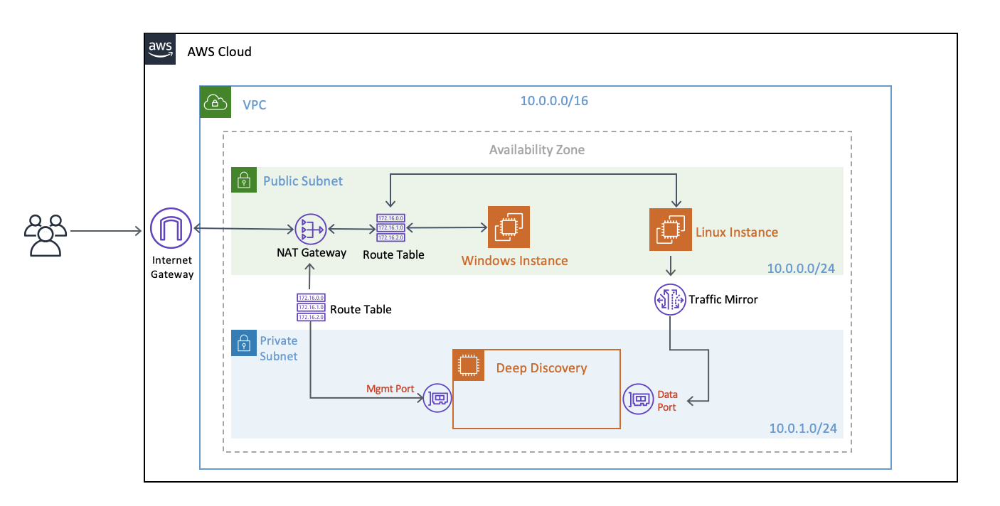

# Deep Discovery on AWS Demo:

## Requirements:
- [AWS Account](https://portal.aws.amazon.com/billing/signup/iam?type=enterprise#/account);
- A Trend Micro Deep Discovery license;

## What this template deploy:

- Network:
    - 1x VPC;
    - 2x Subnets (Public and Private);
    - 1x Nat Gateway;
    - 1x Internet Gateway;
    - 2x Route Tables;
    - 1x Traffic Mirror;
- Compute:
    - 1x Windows Machine (To access the DDI Web UI);
    - 1x Linux Machine (To generate traffic on DDI Data Port);
    - 1x DDI with 2 ENI (Mgmt and Data Port);

This is how the general architecture looks like:




```This template only works on us-east-1, if you want to use it in another region, you will have to modify the AMI IDs and deploy using the regions choose``

## How-To:

- Clone this GitHub repository;
- Deploy this Cloud Formation template to your AWS Account, using the console or the CLI;

For the deploy you will need to use 2 parameters:

- Your EC2 Keypair;
- Your Public IP (To allow the machines to be accessible to your IP only);

## Results and Post-Action:

When the template finish deployment, you will need to access the Bastion Host (Windows Machine) login to the DDI, configure the appliance and add the license(I do not intend to cover how to do this here). After this, you can go to the Linux machine and generate any traffic to be detected by DDI, here something that you can start with:

```wget http://ca91-1.winshipway.com/```<br/>
```wget http://wrs49.winshipway.com/```<br/>
```wget http://wrs65.winshipway.com/```<br/>
```wget http://wrs70.winshipway.com/```

But feel free to generate any traffic that you want...

## Clean up

To clean up your demo, just delete the Cloud Formation stack that you created.

## Contributing

If you encounter a bug, think of a useful feature, or find something confusing
in the docs, please
[create a new issue](https://github.com/felipecosta09/DDI-AWS-DEMO/issues/new)!

We :heart: pull requests. If you'd like to fix a bug, contribute to a feature or
just correct a typo, please feel free to do so.

If you're thinking of adding a new feature, consider opening an issue first to
discuss it to ensure it aligns with the direction of the project (and potentially
save yourself some time!).

## Support

Official support from Trend Micro is not available. Individual contributors may
be Trend Micro employees, but are not official support.